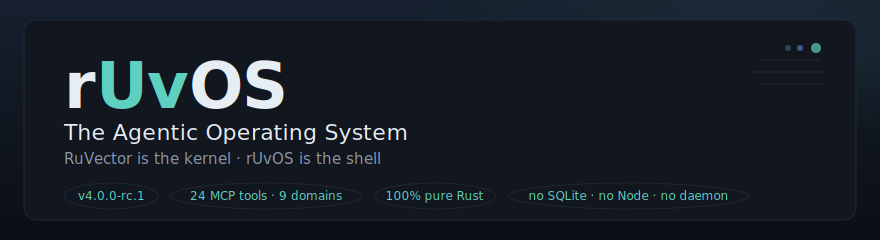
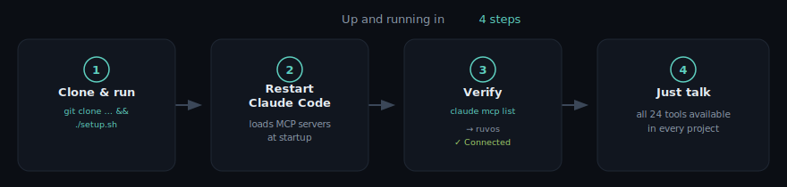
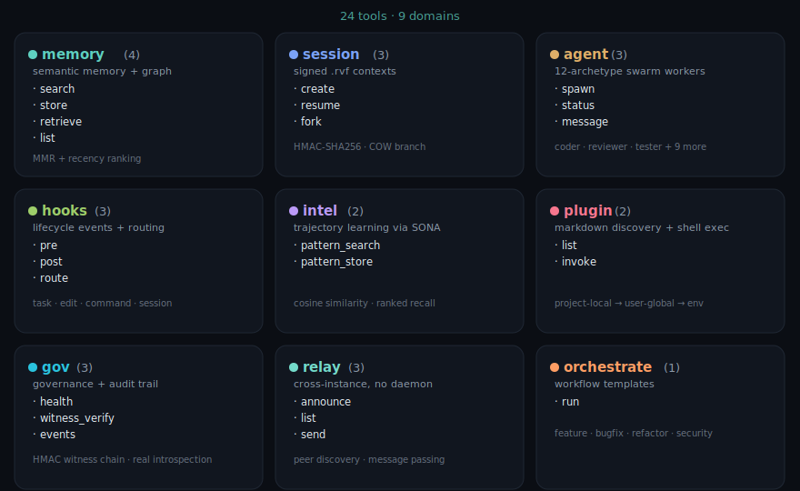
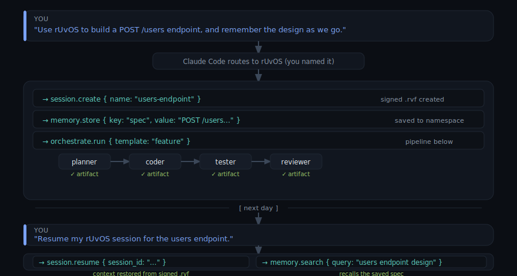
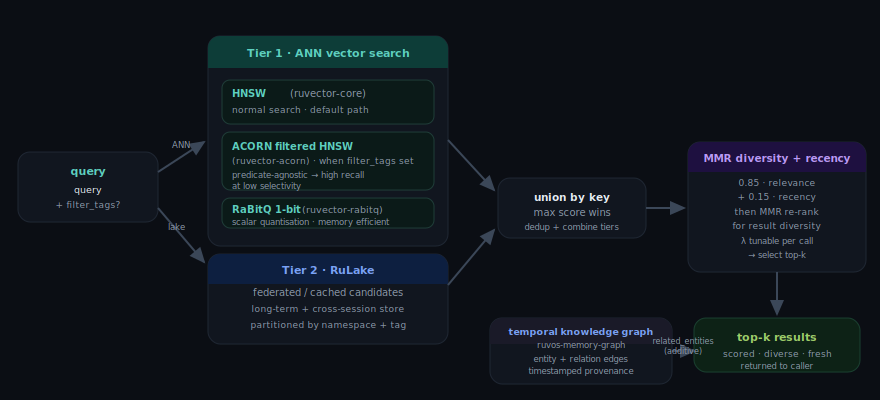
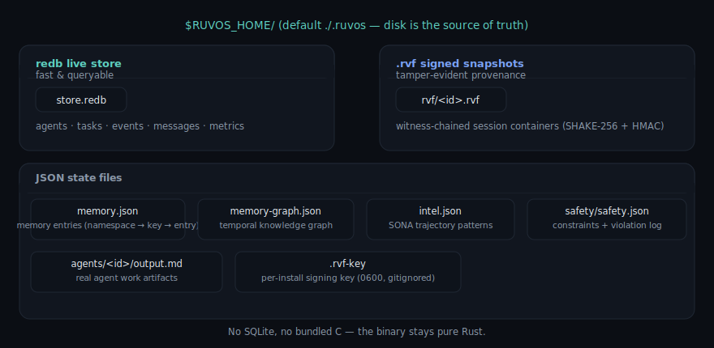

<p align="center">
  
</p>

<p align="center">
  
  
  
  
  
  
</p>

---

## What is this? (in one breath)

**rUvOS gives Claude Code (or Codex / Gemini) a memory and a team.**

Out of the box, an AI coding assistant forgets everything between sessions, works
alone, and leaves no trace of *why* it did what it did. rUvOS fixes that. It's a
single small program you run once; after that, your assistant can **remember**
decisions across days, **resume** exactly where it left off, **spin up a team of
specialist agents**, **coordinate across terminals**, and keep a **signed,
tamper-evident log** of everything that happened — all stored on your own disk.

It plugs in through the **Model Context Protocol (MCP)**, the standard way tools
talk to AI assistants. You don't learn new commands — **you just talk**, and the
assistant calls the right rUvOS tool for you.

```
🧠  Memory       remembers facts & decisions, recalls by meaning — survives restarts
💾  Sessions     resumable work contexts as signed .rvf files; fork before risky changes
👥  Agents       12 specialist archetypes (coder, tester, security, …) + pipelines
🛡️  Safety       risk-checks destructive actions before they run
📡  Relay        independent Claude Code instances discover & message each other
🧾  Provenance   a signed audit log + cryptographic verification of every session file
```

…and it's **one static Rust binary** — no Node.js, no SQLite, no background daemon,
no external database.

> **The tagline:** *RuVector is the kernel, rUvOS is the shell.*
> RuVector is the self-learning vector + graph + crypto substrate; rUvOS is the
> orchestration layer that turns it into tools your assistant can use.

> ### 🙏 Built on the work of giants: [**rUv**](https://github.com/ruvnet)
>
> rUvOS exists because of **rUv (Reuven Cohen / [@ruvnet](https://github.com/ruvnet))** —
> the original creator behind **Ruflo / claude-flow**, **RuVector**, the **`.rvf`**
> format, **SONA**, **ruv-swarm**, and **ruv-FANN**. Every kernel capability here —
> the vector search, the witness chains, the swarm transport, the self-optimizing
> learning — traces back to rUv's research and code. rUvOS is a Rust-native
> consolidation of that ecosystem; the hard, original ideas are his. **Huge thanks
> and full credit to rUv.** 🚀

> ⚠️ **NOT BACKWARD COMPATIBLE WITH RUFLO v2/v3.**
> rUvOS v4 is a clean-room Rust rewrite. It is **not** compatible with the Ruflo
> v2/v3 npm CLI (`ruflo` / `@claude-flow/cli`). There's **no migration path** — the
> clean break is intentional. Running [`./setup.sh`](#install) uninstalls that old
> npm CLI but **leaves your `claude-flow` / `ruv-swarm` MCP servers and plugins
> alone — they coexist fine** (separate namespaces, processes, and data dirs).

---

## Table of contents

- [Install](#install) · [How you actually use it](#how-you-actually-use-it-just-talk)
- [The 24 tools](#the-24-tools) · [A natural-language session](#a-natural-language-session)
- [Feature reference (every tool, by example)](#feature-reference--every-tool-by-example)
  - [memory](#memory--persistent-semantic-memory--knowledge-graph) ·
    [session](#session--resumable-signed-work-contexts) ·
    [agent](#agent--spawn-track-and-message-agents) ·
    [hooks](#hooks--lifecycle-hooks-safety--routing) ·
    [intel](#intel--sona-trajectory-learning) ·
    [plugin](#plugin--discover-and-run-plugins) ·
    [gov](#gov--health-provenance--audit) ·
    [relay](#relay--cross-instance-coordination) ·
    [orchestrate](#orchestrate--multi-agent-orchestration-templates)
- [Agent archetypes & traits](#agent-archetypes--traits) · [Where your data lives](#where-your-data-lives)
- [Architecture](#architecture) · [Development](#development) · [Acknowledgments](#acknowledgments) · [License](#license)

---

## Install

<p align="center">
  
</p>

### One-shot (recommended)

Clone and run the installer — it does **everything**: builds the binary, removes the
legacy Ruflo v2/v3 npm CLI, installs `ruvos` onto your `PATH`, sets `RUVOS_HOME`,
registers the MCP server with Claude Code, and verifies the result.

```bash
git clone https://github.com/dgdev25/ruvos.git
cd ruvos
./setup.sh
```

Then:

1. **Restart Claude Code.** It loads MCP servers at startup, so a fresh start is
   needed to pick up the newly-registered `ruvos` server.
2. Open a new terminal (so `PATH`/`RUVOS_HOME` take effect) and confirm:

```bash
claude mcp list          # ruvos: ✓ Connected
```

That's it — all 24 rUvOS tools are now available to Claude Code in every project.

> **What `setup.sh` removes:** only the incompatible **v2/v3 npm CLI**
> (`ruflo`, `@claude-flow/cli`) + its npm cache.
> **What it leaves alone (both coexist with rUvOS):**
> - `claude-flow` / `ruv-swarm` **MCP servers** — different namespace, process, and
>   data dir; no conflict. Name "rUvOS" in requests to disambiguate.
> - Ruflo **Claude Code plugins** — user-managed; remove via `/plugin` only if you want.

**`setup.sh` flags:** `--no-mcp` (skip MCP registration) · `--prefix DIR` (install
location) · `--help`.

### Manual install (if you prefer)

```bash
cargo build --release
# Install onto your PATH. ~/.cargo/bin is already on PATH (you have Rust) — no sudo:
cp target/release/ruvos ~/.cargo/bin/ruvos               # or ~/.local/bin
export RUVOS_HOME="$HOME/.ruvos"                          # shared data dir (optional)
claude mcp add ruvos --scope user -- ruvos mcp serve      # register with Claude Code
claude mcp list                                           # ruvos: ✓ Connected
```

> For a **system-wide** install, use `sudo cp target/release/ruvos /usr/local/bin/ruvos`
> — `sudo` is only needed because `/usr/local/bin` is root-owned. A per-user dir like
> `~/.cargo/bin` needs none. `RUVOS_HOME` defaults to `./.ruvos`; set it to share one
> memory/session store across every project.

---

## How you actually use it: just talk

**You do not type commands or keywords.** Once the MCP server is connected, Claude
Code sees the 24 tools and decides which to call based on what you ask.

> 💡 **Say "rUvOS" in your request.** If you also run other agent MCP servers or
> plugins (e.g. legacy `ruflo` / `claude-flow`), several offer overlapping
> capabilities. Naming rUvOS explicitly — *"use rUvOS to…"*, *"have rUvOS
> remember…"* — steers the request to rUvOS instead of leaving it to chance.

| You say… | …and rUvOS handles it with |
|----------|----------------------------|
| *"Use rUvOS to help me build a POST /users endpoint"* | `session.create`, `agent.spawn` |
| *"Have rUvOS remember we're using PostgreSQL for this project"* | `memory.store` |
| *"Ask rUvOS what we decided about the database schema"* | `memory.search` |
| *"Resume my rUvOS session from yesterday"* | `session.resume` |
| *"Have rUvOS orchestrate a full feature pipeline for user auth"* | `orchestrate.run` |
| *"Ask rUvOS if it's safe to run this command"* | `hooks.pre` (risk assessment) |
| *"Check rUvOS system health"* | `gov.health` |
| *"Show me the rUvOS audit log for the last hour"* | `gov.events` |

> These are **representative** mappings, not guarantees. *Which* tool Claude picks
> for a sentence is its own runtime decision. Naming rUvOS makes it far more
> reliable; the only 100%-deterministic route is invoking the tool directly over
> MCP (see the feature reference). What rUvOS guarantees: the tools are **available**
> and **work** — every one is exercised by the test suite.

---

## The 24 tools

<p align="center">
  
</p>

<details>
<summary>📋 Table version (for AI / accessibility)</summary>

| Domain | Tools | What they do |
|--------|-------|--------------|
| **memory** (4) | `search`, `store`, `retrieve`, `list` | Persistent semantic memory — HNSW + RaBitQ vector search, MMR diversity, recency, and a temporal knowledge graph (`related_entities`) |
| **session** (3) | `create`, `resume`, `fork` | Resumable work sessions as **signed `.rvf` containers**; fork = copy-on-write branch with cryptographic lineage |
| **agent** (3) | `spawn`, `status`, `message` | Spawn/track/message agents across 12 archetypes; backed by the redb store + signed snapshots |
| **hooks** (3) | `pre`, `post`, `route` | Pre/post lifecycle hooks (incl. **safety risk assessment**) + model/archetype routing |
| **intel** (2) | `pattern_search`, `pattern_store` | SONA trajectory learning — store outcomes, retrieve similar past approaches |
| **plugin** (2) | `list`, `invoke` | Discover and run plugins (markdown + shell commands) |
| **gov** (3) | `health`, `witness_verify`, `events` | System health + safety score, `.rvf` signature verification, signed audit log |
| **relay** (3) | `announce`, `list`, `send` | Cross-instance coordination — independent Claude Code instances discover and message each other via pure file mailboxes (no daemon, no port, no DB) |
| **orchestrate** (1) | `run` | Orchestration templates: `feature` / `bugfix` / `refactor` / `security` |

</details>

---

## A natural-language session

In Claude Code you never type tool calls — you talk, and Claude calls the tools.
Here's a typical session, end to end:

<p align="center">
  
</p>

<details>
<summary>⌨️ Transcript version (for AI / accessibility)</summary>

```
You:  Use rUvOS to build a POST /users endpoint with validation, and have it
      remember the design as we go.

Claude (routing to rUvOS because you named it):
  → session.create  { name: "users-endpoint" }
  → memory.store    { key: "spec", value: "POST /users, zod validation, ...",
                      namespace: "users-api" }
  → orchestrate.run { template: "feature", task: "POST /users with validation" }
  ...planner → coder → tester → reviewer run, each leaving a real artifact...

[next day]
You:  Resume my rUvOS session for the users endpoint.
Claude:
  → session.resume  { session_id: "..." }   # full context restored from signed .rvf
  → memory.search   { query: "users endpoint design", namespace: "users-api" }
```

</details>

Everything below shows the **same tools driven directly over MCP** — useful for
scripting, CI, tests, or any MCP client. rUvOS speaks JSON-RPC on stdin/stdout;
pipe one `initialize` line then `tools/call` lines into `ruvos mcp serve`.

---

## Feature reference — every tool, by example

Each tool below has a plain-English description, the phrase you'd typically say
(🗣️), and an example showing the call and what it returns. To run any of them
yourself, wrap the call line with the transport boilerplate:

```bash
printf '%s\n' \
'{"jsonrpc":"2.0","id":0,"method":"initialize","params":{}}' \
'<the call line below>' \
| ruvos mcp serve
```

---

### `memory` — persistent semantic memory + knowledge graph

Vector search (HNSW + RaBitQ) with diversity and recency, plus a temporal
knowledge graph. Survives restarts. Retrieval runs in tiers:

<p align="center">
  
</p>

**`memory.store`** — save a fact you want remembered later.
🗣️ *"rUvOS, remember we're using PostgreSQL for this project."*
```jsonc
{"name":"memory.store","arguments":{"key":"db","value":"postgres connection pooling via pgbouncer","namespace":"proj","tags":["infra"]}}
// → { "status":"stored", "key":"db", "namespace":"proj" }
```

**`memory.search`** — recall by meaning, not exact words; also returns related
entities from the knowledge graph. Pass optional `filter_tags` to restrict results
to entries carrying *all* those tags — this routes retrieval through ACORN
(predicate-agnostic filtered HNSW), which keeps recall high even when the tag
filter is highly selective.
🗣️ *"rUvOS, what did we decide about the database?"*
```jsonc
{"name":"memory.search","arguments":{"query":"database connection","namespace":"proj","top_k":5}}
// → { "count":1, "results":[{ "key":"db", "value":"postgres connection pooling…", "score":0.64 }],
//     "related_entities":[{ "name":"Postgres", "summary":"…" }] }

// tag-filtered: only entries tagged "decision" AND "db", best match first
{"name":"memory.search","arguments":{"query":"database connection","namespace":"proj","filter_tags":["decision","db"]}}
```

**`memory.retrieve`** — fetch one entry by its exact key.
```jsonc
{"name":"memory.retrieve","arguments":{"key":"db","namespace":"proj"}}
// → { "found":true, "key":"db", "value":"postgres connection pooling…", "tags":["infra"] }
```

**`memory.list`** — list everything stored in a namespace.
```jsonc
{"name":"memory.list","arguments":{"namespace":"proj"}}
// → { "namespace":"proj", "count":1, "entries":[ … ] }
```

---

### `session` — resumable, signed work contexts

A session is a signed `.rvf` container on disk. You can pick work back up later, and
`fork` makes a copy-on-write branch with a cryptographic link to its parent.

**`session.create`** — start a session you can return to.
🗣️ *"rUvOS, let's start working on the users endpoint."*
```jsonc
{"name":"session.create","arguments":{"name":"users-endpoint","state":{"branch":"feat/users"}}}
// → { "session_id":"6305…", "name":"users-endpoint", "rvf_path":".ruvos/rvf/6305….rvf", "status":"created" }
```

**`session.resume`** — restore the full context of a past session (signature
verified first).
🗣️ *"rUvOS, pick up where we left off yesterday."*
```jsonc
{"name":"session.resume","arguments":{"session_id":"6305…"}}
// → { "found":true, "name":"users-endpoint", "state":{ "branch":"feat/users" }, "status":"resumed" }
```

**`session.fork`** — branch a session before a risky change; the child links back to
the parent.
🗣️ *"rUvOS, fork this before we try the big refactor."*
```jsonc
{"name":"session.fork","arguments":{"source_session_id":"6305…"}}
// → { "forked_id":"a1b2…", "source_session_id":"6305…", "status":"forked", "success":true }
```

---

### `agent` — spawn, track, and message agents

Spawn one of 12 archetypes (coder, tester, reviewer, …). Each produces a real work
artifact on disk and is saved in the shared store.

**`agent.spawn`** — put an agent to work on a prompt.
🗣️ *"rUvOS, get a coder to write the POST /users handler."*
```jsonc
{"name":"agent.spawn","arguments":{"archetype":"coder","prompt":"write the POST /users handler","model":"claude-haiku-4-5","traits":["backend"]}}
// → { "agent_id":"7ed0…", "archetype":"coder", "status":"completed",
//     "artifact_path":".ruvos/agents/7ed0…/output.md", "artifact_bytes":264 }
```

**`agent.status`** — see what agents exist and their state (all, or one by id).
🗣️ *"rUvOS, what are my agents up to?"*
```jsonc
{"name":"agent.status","arguments":{}}
// → { "count":2, "agents":[{ "agent_id":"7ed0…", "archetype":"coder", "status":"completed" }, … ] }
```

**`agent.message`** — send a follow-up message to an agent.
🗣️ *"rUvOS, tell the coder to also add pagination."*
```jsonc
{"name":"agent.message","arguments":{"agent_id":"7ed0…","message":"also add pagination"}}
// → { "delivered":true, "message_id":"…", "message_count":1 }
```

---

### `hooks` — lifecycle hooks, safety & routing

Safety checks before risky actions, model/archetype routing, and outcome recording
that feeds learning.

**`hooks.pre`** — risk-assess an action before it runs; flags destructive commands.
🗣️ *"rUvOS, is it safe to run this command?"*
```jsonc
{"name":"hooks.pre","arguments":{"kind":"command","payload":{"command":"<a destructive shell command>"}}}
// → { "status":"ok", "blocked":true,
//     "safety":{ "passed":false, "safety_score":0.7,
//                "violations":[{ "constraint":"destructive_command", "level":"High" }] } }
```

**`hooks.route`** — pick the best archetype + model tier for a task.
🗣️ *"rUvOS, who should handle a security audit?"*
```jsonc
{"name":"hooks.route","arguments":{"task":"audit auth flow for injection vulnerabilities"}}
// → { "archetype":"security", "model":"claude-opus-4-8", "tier":3, "confidence":0.8 }
```

**`hooks.post`** — record how an action turned out (feeds SONA learning).
```jsonc
{"name":"hooks.post","arguments":{"kind":"task","payload":{"task":"build endpoint"},"success":true,"message":"green"}}
// → { "status":"ok", … }
```

---

### `intel` — SONA trajectory learning

Remember the steps you took and how they turned out, then find similar past
approaches later.

**`intel.pattern_store`** — record a sequence of steps and its outcome.
🗣️ *"rUvOS, remember how we did that migration."*
```jsonc
{"name":"intel.pattern_store","arguments":{"trajectory":["read schema","write migration","run tests"],"outcome":"success: migration applied"}}
// → { "status":"stored", "pattern_id":"…", "total_patterns":1 }
```

**`intel.pattern_search`** — find past approaches similar to what you're doing now.
🗣️ *"rUvOS, have we done something like this before?"*
```jsonc
{"name":"intel.pattern_search","arguments":{"query":"database migration schema","top_k":5}}
// → { "count":1, "patterns":[{ "outcome":"success: migration applied", "score":0.71, … }] }
```

---

### `plugin` — discover and run plugins

Plugins are markdown + shell commands found under `./.ruvos/plugins`,
`~/.ruvos/plugins`, etc. `invoke` only runs commands a plugin actually declares
(command-injection guard).

**`plugin.list`** — see what plugins are installed.
🗣️ *"rUvOS, what plugins do I have?"*
```jsonc
{"name":"plugin.list","arguments":{}}
// → { "count":0, "plugins":[] }
```

**`plugin.invoke`** — run a command a plugin provides.
🗣️ *"rUvOS, run my-plugin's build command."*
```jsonc
{"name":"plugin.invoke","arguments":{"plugin_name":"my-plugin","command":"build","args":["--release"]}}
// → { "status":0, "stdout":"…", "stderr":"" }   // unknown plugin → status:1 + reason in stderr
```

---

### `gov` — health, provenance & audit

**`gov.health`** — a real status report: tools, data dir, what's stored, safety score.
🗣️ *"rUvOS, what's the system health?"*
```jsonc
{"name":"gov.health","arguments":{}}
// → { "status":"ok", "version":"4.0.0-rc.1", "tool_count":24,
//     "persisted":{ "agents":2, "memory_entries":1, "sessions":1 },
//     "safety":{ "score":1.0, "active_constraints":5, "recent_violations":0 } }
```

**`gov.witness_verify`** — confirm a session file hasn't been tampered with.
🗣️ *"rUvOS, is this .rvf file still valid?"*
```jsonc
{"name":"gov.witness_verify","arguments":{"rvf_path":".ruvos/rvf/6305….rvf"}}
// → { "rvf_path":"…", "verified":true, "exists":true }
```

**`gov.events`** — query the signed audit log of what happened.
🗣️ *"rUvOS, show me what happened in the last hour."*
```jsonc
{"name":"gov.events","arguments":{"event_type":"agent.spawned","limit":20}}
// → { "count":2, "events":[{ "event_type":"agent.spawned", "agent_id":"7ed0…", "timestamp":… }, … ] }
```

---

### `relay` — cross-instance coordination

Two independent Claude Code instances (e.g. one on the backend, one on the frontend)
discover and message each other by sharing one `RUVOS_HOME`. **No daemon, no port,
no database** — presence and messages are plain files, delivered the next time
someone calls `relay.list`. Instances quiet for 60s are pruned automatically.

<p align="center">
  
</p>

```bash
# Both terminals point at the same relay directory:
export RUVOS_HOME=/home/you/.ruvos
```

**`relay.announce`** — tell other instances who you are and what you're doing.
🗣️ *"rUvOS, let the other sessions know I'm on the backend."*
```jsonc
{"name":"relay.announce","arguments":{"summary":"backend: auth endpoints"}}
// → { "id":"A-uuid", "pid":…, "cwd":"…", "git_repo":"…", "summary":"backend: auth endpoints" }
```

**`relay.list`** — discover other live instances and read your own inbox (drained on
read). Scope is `machine`, `directory`, or `repo`.
🗣️ *"rUvOS, who else is working right now, and any messages for me?"*
```jsonc
{"name":"relay.list","arguments":{"scope":"machine"}}
// → { "count":1, "relays":[{ "id":"A-uuid", "summary":"backend: auth endpoints" }],
//     "inbox":[{ "from":"B-uuid", "body":"login form posts to /auth/login — confirm the shape?" }] }
```

**`relay.send`** — message another instance by id.
🗣️ *"rUvOS, ask the backend session to confirm the login shape."*
```jsonc
{"name":"relay.send","arguments":{"to":"A-uuid","body":"login form posts to /auth/login — confirm the shape?"}}
// → { "delivered":true, "message_id":"…" }
```

> 🧾 **Durable provenance, even though the mailboxes are ephemeral.** The relay
> files themselves are deliberately throwaway — plain JSON (`<id>.json` presence +
> `<id>.inbox/<msg>.json` messages), **not `.rvf`**, pruned after 60s. But **every
> `relay.announce` and `relay.send` is written to the signed `gov.events` audit log**
> (in the redb store). So the *fact that* two instances coordinated — who announced,
> who messaged whom, when — is **permanently and verifiably recorded**, while the
> transient mailbox files are free to disappear. You get lightweight coordination
> *and* a tamper-evident trail of it.

---

### `orchestrate` — multi-agent orchestration templates

One call runs an ordered pipeline of agents; each step leaves a real artifact.
A **GOAP (A\*) planner computes** the archetype sequence — from a named template
or a caller-supplied `goal` + `capabilities` — rather than running a hardcoded
script (the static templates remain as a fallback). Templates: `feature`
(planner → coder → tester → reviewer), `bugfix` (researcher → coder → tester),
`refactor` (architect → coder → tester → reviewer), `security`
(security → coder → tester), `sparc` (the 5-phase methodology). The response
includes `planned` and `plan_cost`.

**`orchestrate.run`** — run a whole pipeline for a task in one go.
🗣️ *"rUvOS, orchestrate a full feature pipeline for user auth."*
```jsonc
{"name":"orchestrate.run","arguments":{"template":"feature","task":"build POST /users with validation"}}
// → { "orchestration_id":"…", "template":"feature", "status":"completed",
//     "planned":true, "plan_cost":4.0, "step_count":4,
//     "steps":[ { "archetype":"planner",  "agent_id":"…", "artifact_path":"…" },
//               { "archetype":"coder",    … }, { "archetype":"tester", … },
//               { "archetype":"reviewer", … } ] }

// computed pipeline from a goal (no template) — the planner derives the steps:
{"name":"orchestrate.run","arguments":{"task":"harden auth","goal":{"secured":true,"tested":true}}}
// → { "template":"custom", "planned":true, "steps":[ {"archetype":"security"}, {"archetype":"coder"}, {"archetype":"tester"} ] }
```

---

## Agent archetypes & traits

`agent.spawn` and `orchestrate.run` use 12 archetypes, composable with traits:

**Archetypes:** `coder`, `reviewer`, `tester`, `researcher`, `architect`, `planner`,
`security`, `perf`, `devops`, `data`, `docs`, `coordinator`

**Traits** (modify prompt + tool allow-list + model tier): `--trait=tdd`,
`--trait=backend`, `--trait=frontend`, `--trait=mobile`, `--trait=ml`,
`--trait=domain`, `--trait=cloud`, `--trait=db`, `--trait=audit`, and coordinator
`--topology=hierarchical|mesh|adaptive`.

---

## Where your data lives

All state persists under `$RUVOS_HOME` (default `./.ruvos`). **Disk is the source of
truth** — state survives restarts and is verifiable across processes.

<p align="center">
  .rvf — witness-chained session containers), plus JSON state files: memory.json, memory-graph.json, intel.json, safety/safety.json, agents/<id>/output.md, and the per-install signing key .rvf-key. No SQLite, no bundled C." width="100%">
</p>

<details>
<summary>🗂️ Tree version (for AI / accessibility)</summary>

```
$RUVOS_HOME/
├── rvf/<id>.rvf        # signed, witness-chained session containers
├── store.redb          # redb live store: agents, tasks, events, messages, metrics
├── memory.json         # memory entries (namespace → key → entry)
├── memory-graph.json   # temporal knowledge graph
├── intel.json          # SONA trajectory patterns
├── safety/safety.json  # safety constraints + violation log
├── agents/<id>/output.md   # real agent work artifacts
└── .rvf-key            # per-install signing key (0600; gitignored — never commit)
```

</details>

**Storage model:** `redb` (pure-Rust embedded DB) is the fast, queryable working
store; `.rvf` containers are signed, tamper-evident snapshots for provenance and
portability. No SQLite, no bundled C — the binary stays pure Rust.

---

## Architecture

rUvOS is two layers: a thin **orchestration shell** (6 crates) on top of the
**RuVector kernel + substrate** (pure-Rust vector search, learning, graph, crypto,
and distributed building blocks).

<p align="center">
  
</p>

<details>
<summary>🌳 Tree version (for AI / accessibility)</summary>

```
crates/                    # rUvOS orchestration shell (the 6 new crates)
├── ruvos-cli              # clap CLI: `ruvos init`, `ruvos mcp serve`
├── ruvos-mcp              # JSON-RPC MCP server + the 24 tool handlers
├── ruvos-host             # CliHost trait + Claude/Codex adapters
├── ruvos-plugin-host      # plugin discovery + shell execution
├── ruvos-hooks            # hooks + SONA learning (pure Rust, no SQLite)
└── ruvos-session          # .rvf containers + fork + witness-chain verify

substrate/                 # RuVector kernel + vendored capabilities (all pure Rust)
  active in tools ───────────────────────────────────────────────
  ├── ruvector-core         # HNSW vector index + VectorDB (redb storage)
  ├── ruvector-rabitq       # 1-bit quantized ANN search
  ├── ruvector-acorn        # predicate-agnostic filtered HNSW (tag-filtered search)
  ├── sona                  # self-optimizing pattern learning
  ├── rvf-crypto            # SHAKE-256 witness chains + HMAC attestation
  ├── ruvos-store           # redb store + signed .rvf snapshots
  ├── ruvos-memory-graph    # temporal knowledge graph (petgraph)
  ├── ruvos-safety          # behavioral guardrails / adaptive constraints
  ├── rulake                # federated vector search over many backends
  └── ruv-swarm-transport   # WebSocket + in-process agent messaging
  built & available (compiled + tested in CI, not yet wired to a tool) ──
  ├── ruvector-raft         # Raft consensus for distributed metadata
  ├── ruvector-replication  # data replication / sync
  ├── ruvector-cluster      # clustering + sharding
  ├── ruvector-router-core  # vector DB + neural routing engine
  └── rvf-federation        # federated transfer learning (PII strip + diff-privacy)
  (+ rvf-* container stack, ruvector-math, mcp-brain)
```

</details>

**Wiring status.** The teal crates are consumed by the live tool handlers today
(e.g. `ruvector-acorn` powers tag-filtered `memory.search`). The dimmed crates are
**built, linted, and tested as workspace members** so they stay green under the
zero-defect policy and are ready to wire to a tool without a separate integration —
they're available substrate, not dead code. Crates needing special toolchains
(`rvf-wasm`, `rvf-ebpf`, `rvf-node`, `rvf-kernel`) and the local-inference runtime
(`ruvllm`, deferred to v2) are intentionally held out of the workspace.

**MCP protocol:** rUvOS implements the full handshake (`initialize` →
`notifications/initialized` → `tools/list` → `tools/call`), so any MCP client
(Claude Code, Codex CLI) discovers and calls the tools natively.

Key decisions are recorded as ADRs in `docs/spec/` (e.g. ADR-001: redb + `.rvf`
persistence; ADR-002: relay; ADR-003: rename workflow → orchestrate).

---

## Development

```bash
# Build / run
cargo build --release
ruvos mcp serve

# Full zero-defect gate (use --jobs 4 to avoid OOM on the 30+ crate tree)
cargo build  --workspace --jobs 4
cargo clippy --workspace --all-targets --jobs 4 -- -D warnings
cargo fmt --check
cargo test  --workspace --jobs 4
```

**Project rules** (enforced; see `CLAUDE.md`):
- **Zero-defect policy** — the entire workspace stays clean (0 errors, 0 warnings,
  0 failing tests) at all times, including vendored substrate crates.
- **File size limit** — every `.rs` file ≤ 500 lines.
- **One tool domain per scope** — new MCP tools require an ADR (current: 24 tools).

---

## Acknowledgments

**rUvOS is built entirely on the foundational work of [rUv (Reuven Cohen /
@ruvnet)](https://github.com/ruvnet).**

rUv created the original ecosystem this project consolidates and re-implements in
Rust:

- **Ruflo / claude-flow** — the agent orchestration system rUvOS is the v4 rewrite of
- **RuVector** — the self-learning vector + graph + local-AI kernel (`ruvector-core`,
  `ruvector-rabitq`, `ruvector-acorn`, `sona`, …)
- **The `.rvf` format & witness chains** (`rvf-crypto`, `rvf-*`) — signed,
  tamper-evident state containers
- **ruv-swarm / ruv-FANN** — swarm coordination, transport, and neural forecasting
- **RuLake**, **agentdb**, and the broader rUvnet research corpus

The architecture, the hard algorithms, and the original vision are rUv's. rUvOS's
contribution is a ruthless Rust-native consolidation — fewer tools, one static
binary, zero-defect discipline — on top of that foundation. **Thank you, rUv.** 🙏🚀

Explore the originals at **https://github.com/ruvnet**.

---

## License

MIT — consistent with the upstream rUvnet projects.
