<p align="center">
  
</p>

<p align="center">
  
  
  
  
  
  
</p>

## What is this?

Out of the box, an AI coding assistant forgets everything between sessions, works
alone, and leaves no trace of *why* it did what it did. **rUvOS fixes that.**

It's a single small program you run once. After that, your assistant (Claude Code,
and also Codex) can **remember** decisions across days, **resume** exactly where it
left off, **spin up a team of specialist agents**, **coordinate across terminals**,
and keep a **signed, tamper-evident log** of everything that happened — all stored on
your own disk.

It connects through the **Model Context Protocol (MCP)** — the standard way tools
talk to AI assistants — so you don't learn new commands. **You just talk**, and the
assistant calls the right rUvOS tool for you.

And it's **one static Rust binary**: no Node.js, no SQLite, no background service, no
external database, no cloud account.

> **The tagline:** *RuVector is the kernel, rUvOS is the shell.* RuVector is the
> self-learning vector + graph + crypto substrate; rUvOS is the orchestration layer
> that turns it into tools your assistant can use.

> ### 🙏 Built on the work of [**rUv** (Reuven Cohen / @ruvnet)](https://github.com/ruvnet)
> rUvOS consolidates and re-implements rUv's ecosystem — **Ruflo / claude-flow**,
> **RuVector**, the **`.rvf`** format, **SONA**, **ruv-swarm**, **ARCADIA**,
> **midstream**, and more — into one Rust binary. The hard, original ideas are his.
> **Huge thanks and full credit to rUv.** 🚀

> ⚠️ **Not compatible with the Ruflo v2/v3 npm CLI.** rUvOS v4 is a clean-room Rust
> rewrite; there's no migration path. Running [`./setup.sh`](#-quickstart) uninstalls
> that old npm CLI but **leaves your `claude-flow` / `ruv-swarm` MCP servers and
> plugins alone — they coexist fine** (separate namespaces, processes, and data dirs).

---

## ✨ Highlights

<p align="center">
  
</p>

- 🧠 **Memory that lasts** — store facts and recall them by *meaning*, not exact words. Hybrid search (dense vectors + BM25 keywords) with a temporal knowledge graph, and a feedback loop that learns which results were useful.
- 💾 **Resumable, signed sessions** — each work context is a signed `.rvf` file you can return to days later; `fork` branches one before a risky change.
- 👥 **A team of agents** — spawn 12 specialist archetypes (coder, tester, security, …); a planner *computes* the pipeline for your goal, and failed steps retry or stop.
- 🛡️ **Safety + provenance built in** — risky actions are risk-checked before they run, and every action lands in a signed audit log you can verify.
- 📡 **Multi-terminal coordination** — independent Claude Code instances discover and message each other through plain files; no daemon, no port, no database.

---

## 🚀 Quickstart

<p align="center">
  
</p>

```bash
git clone https://github.com/dgdev25/ruvos.git
cd ruvos
./setup.sh                # builds the binary, installs it, registers the MCP server
```

Then **restart Claude Code** (it loads MCP servers at startup), open a new terminal,
and confirm:

```bash
claude mcp list           # ruvos: ✓ Connected
```

That's it — all 45 rUvOS tools are now available to Claude Code in every project.

<details>
<summary>What <code>setup.sh</code> removes (and what it leaves alone)</summary>

- **Removes:** only the incompatible **v2/v3 npm CLI** (`ruflo`, `@claude-flow/cli`) + its npm cache.
- **Leaves alone (both coexist with rUvOS):** `claude-flow` / `ruv-swarm` MCP servers (different namespace/process/data dir) and any Ruflo Claude Code plugins. Name "rUvOS" in a request to disambiguate overlapping capabilities.

**Flags:** `--no-mcp` (skip MCP registration) · `--prefix DIR` (install location) · `--help`.
</details>

<details>
<summary>Manual install (if you prefer)</summary>

```bash
cargo build --release
cp target/release/ruvos ~/.cargo/bin/ruvos            # already on PATH (you have Rust) — no sudo
export RUVOS_HOME="$HOME/.ruvos"                       # shared data dir (optional)
claude mcp add ruvos --scope user -- ruvos mcp serve   # register with Claude Code
claude mcp list                                        # ruvos: ✓ Connected
```

`RUVOS_HOME` defaults to `./.ruvos`; set it to share one memory/session store across every project.
</details>

---

## 🧭 How it works

**You don't type commands or keywords.** Once the MCP server is connected, Claude
Code sees the 45 tools and decides which to call from what you ask. The loop:

<p align="center">
  
</p>

You ask in plain language; rUvOS **recalls** relevant past decisions, a planner
**computes** the agent pipeline for the goal, the **agents run** (a failed step
retries or stops the pipeline), and the **outcome is learned** — which sharpens the
next recall and plan. That feedback loop is the point: the system gets better the
more you use it. Underneath every step, a safety gate vets risky actions and a signed
audit log records what happened.

> 💡 **Say "rUvOS" in your request.** If you also run other agent tools with
> overlapping capabilities, naming rUvOS explicitly — *"use rUvOS to…"*, *"have rUvOS
> remember…"* — reliably routes the request to it.

| You say… | …and rUvOS handles it with |
|----------|----------------------------|
| *"Use rUvOS to build a POST /users endpoint"* | `session.create`, `orchestrate.run` |
| *"Have rUvOS remember we're using PostgreSQL"* | `memory.store` |
| *"Ask rUvOS what we decided about the schema"* | `memory.search` |
| *"Resume my rUvOS session from yesterday"* | `session.resume` |
| *"Ask rUvOS if it's safe to run this command"* | `hooks.pre` (risk assessment) |
| *"Show me the rUvOS audit log for the last hour"* | `gov.events` |

*Which* tool Claude picks for a sentence is its own runtime decision — naming rUvOS
makes it reliable; the only 100%-deterministic route is calling the tool directly
over MCP (see the feature reference). What rUvOS guarantees: the tools are
**available** and **work** — every one is exercised by the test suite.

---

## 💡 A real session

In Claude Code you talk; Claude calls the tools. A typical arc:

```
You:  Use rUvOS to build a POST /users endpoint with validation, and remember
      the design as we go.

Claude (routing to rUvOS because you named it):
  → session.create   { name: "users-endpoint" }            # signed .rvf created
  → memory.store     { key: "spec", value: "POST /users, zod validation, …" }
  → orchestrate.run  { template: "feature", task: "POST /users with validation" }
        planner → coder → tester → reviewer   (computed by the planner; each leaves an artifact)

[next day]
You:  Resume my rUvOS session for the users endpoint.
Claude:
  → session.resume   { session_id: "…" }   # full context restored from the signed .rvf
  → memory.search    { query: "users endpoint design", namespace: "users-api" }
```

The feature reference below shows the **same tools driven directly over MCP** — for
scripting, CI, or any MCP client. rUvOS speaks JSON-RPC on stdin/stdout: pipe one
`initialize` line then `tools/call` lines into `ruvos mcp serve`.

<details>
<summary>📚 Feature reference — every tool, by example</summary>

Wrap any call line with the transport boilerplate to run it yourself:

```bash
printf '%s\n' \
'{"jsonrpc":"2.0","id":0,"method":"initialize","params":{}}' \
'<the call line below>' \
| ruvos mcp serve
```

### `memory` — persistent semantic memory + knowledge graph
Hybrid retrieval (dense HNSW/RaBitQ + BM25 keywords, fused), MMR diversity, recency,
a temporal knowledge graph, and a bandit that learns from feedback. Survives restarts.

```jsonc
// store a fact
{"name":"memory.store","arguments":{"key":"db","value":"postgres pooling via pgbouncer","namespace":"proj","tags":["infra"]}}

// recall by meaning (also returns related entities from the graph)
{"name":"memory.search","arguments":{"query":"database connection","namespace":"proj","top_k":5}}

// tag-filtered search (predicate-aware ACORN filtered HNSW)
{"name":"memory.search","arguments":{"query":"database","namespace":"proj","filter_tags":["decision","db"]}}

// teach the bandit which result was useful → it ranks higher next time
{"name":"memory.search","arguments":{"query":"database","namespace":"proj","feedback":[{"key":"db","useful":true}]}}

// fetch one entry / list a namespace
{"name":"memory.retrieve","arguments":{"key":"db","namespace":"proj"}}
{"name":"memory.list","arguments":{"namespace":"proj"}}
```

### `session` — resumable, signed work contexts
```jsonc
{"name":"session.create","arguments":{"name":"users-endpoint","state":{"branch":"feat/users"}}}
{"name":"session.resume","arguments":{"session_id":"6305…"}}   // signature verified first
{"name":"session.fork","arguments":{"source_session_id":"6305…"}}   // COW branch with lineage
```

### `agent` — spawn, track, and message agents
```jsonc
{"name":"agent.spawn","arguments":{"archetype":"coder","prompt":"write POST /users","model":"claude-haiku-4-5","traits":["backend"]}}
// → { "agent_id":"7ed0…", "status":"completed", "success":true, "exit_code":null, "artifact_path":"…" }
{"name":"agent.status","arguments":{}}
{"name":"agent.message","arguments":{"agent_id":"7ed0…","message":"also add pagination"}}
```
With an external runner (`RUVOS_AGENT_RUNNER`), `success`/`exit_code` reflect the
runner's real process exit status, its stdout is analyzed **as it streams** (drift
detection), and the response carries `stream: { observed, anomalies }`.

### `hooks` — safety & routing
```jsonc
{"name":"hooks.pre","arguments":{"kind":"command","payload":{"command":"<destructive cmd>"}}}
// → { "blocked":true, "safety":{ "passed":false, "violations":[…] } }
{"name":"hooks.route","arguments":{"task":"audit auth for injection"}}
// → { "archetype":"security", "model":"claude-opus-4-8", "tier":3 }
{"name":"hooks.post","arguments":{"kind":"task","payload":{},"success":true}}
```

### `intel` — SONA trajectory learning
```jsonc
{"name":"intel.pattern_store","arguments":{"trajectory":["read schema","write migration"],"outcome":"success"}}
{"name":"intel.pattern_search","arguments":{"query":"database migration","top_k":5}}
```

### `plugin` — discover and run plugins
```jsonc
{"name":"plugin.list","arguments":{}}
{"name":"plugin.invoke","arguments":{"plugin_name":"my-plugin","command":"build","args":["--release"]}}
```

### `gov` — health, provenance & audit
```jsonc
{"name":"gov.health","arguments":{}}
// → { "status":"ok", "tool_count":45, "persisted":{…}, "safety":{"score":1.0} }
{"name":"gov.witness_verify","arguments":{"rvf_path":".ruvos/rvf/6305….rvf"}}
{"name":"gov.events","arguments":{"event_type":"agent.spawned","limit":20}}
```

### `relay` — cross-instance coordination
Two instances sharing one `RUVOS_HOME` discover and message each other via plain JSON
file mailboxes (`<id>.json` presence + `<id>.inbox/<msg>.json`). No daemon, no port,
no database; 60-second TTL prunes stale instances. Every announce/send is recorded in
the signed `gov.events` audit log — so the *fact that* coordination happened is durable
even though the mailbox files are ephemeral.
```jsonc
{"name":"relay.announce","arguments":{"summary":"backend: auth endpoints"}}
{"name":"relay.list","arguments":{"scope":"machine"}}   // discover + drain inbox
{"name":"relay.send","arguments":{"to":"A-uuid","body":"confirm the login shape?"}}
```

### `orchestrate` — planned multi-agent pipelines
A GOAP (A\*) planner computes the archetype sequence from a template
(`feature`/`bugfix`/`refactor`/`security`/`sparc`) or a caller `goal` + `capabilities`.
Optional `max_retries` loops a failed step back to `coder` for bounded rework.
```jsonc
{"name":"orchestrate.run","arguments":{"template":"feature","task":"build POST /users"}}
// → { "status":"completed", "planned":true, "plan_cost":4.0, "steps":[planner, coder, tester, reviewer] }

// computed from a goal, no template:
{"name":"orchestrate.run","arguments":{"task":"harden auth","goal":{"secured":true,"tested":true}}}
// → { "template":"custom", "planned":true, "steps":[security, coder, tester] }
```

**Agent archetypes:** `coder`, `reviewer`, `tester`, `researcher`, `architect`,
`planner`, `security`, `perf`, `devops`, `data`, `docs`, `coordinator` — composable
with traits (`--trait=tdd`, `--trait=backend`, `--trait=cloud`, …).

</details>

---

## 🏗️ Architecture

rUvOS is two layers in one binary: a thin **orchestration shell** (6 crates) on top
of the **RuVector kernel + substrate** (pure-Rust vector search, learning, graph,
crypto, planning, and coordination).

<p align="center">
  
</p>

**Disk is the source of truth.** All state persists under `$RUVOS_HOME` (default
`./.ruvos`) and is verifiable across processes — `redb` (a pure-Rust embedded
database) is the fast working store, and `.rvf` containers are signed, tamper-evident
snapshots. No SQLite, no bundled C.

<details>
<summary>Where your data lives</summary>

```
$RUVOS_HOME/
├── rvf/<id>.rvf          # signed, witness-chained session containers
├── store.redb            # redb live store: agents, tasks, events, messages, metrics
├── memory.json           # memory entries (namespace → key → entry)
├── memory-rewards.json   # bandit feedback rewards
├── memory-graph.json     # temporal knowledge graph
├── intel.json            # SONA trajectory patterns
├── safety/safety.json    # safety constraints + violation log
├── agents/<id>/output.md # real agent work artifacts
└── .rvf-key              # per-install signing key (0600; gitignored — never commit)
```
</details>

rUvOS implements the full MCP handshake (`initialize` → `notifications/initialized` →
`tools/list` → `tools/call`), so any MCP client discovers and calls the tools
natively. Design decisions are recorded as ADRs in [`docs/spec/`](docs/spec), and
the live tool/archetype/hook contract is generated into
[`docs/contracts/contract-manifest.json`](docs/contracts/contract-manifest.json).
Swarm coordination is documented as a control plane in
[`docs/roadmaps/swarm-layer-strategy.md`](docs/roadmaps/swarm-layer-strategy.md)
even though its commands are exposed through the same MCP tool boundary.

---

## 🩺 Status

**`v4.0.0-rc.1` — production-grade.** 45 MCP tools, real persistence, 2000+ tests,
zero compiler/clippy warnings across the whole workspace (a standing zero-defect
policy). Honest scope notes:

- Vector search is real HNSW + 1-bit RaBitQ + ACORN filtered search; embeddings use
  feature-hashing today (a real, standard technique) — a neural provider can be
  swapped in behind the same API.
- `.rvf` signing uses SHAKE-256 witness chains + HMAC (not the full witness-chain yet).
- The agent **runner** is optional; without one, agents produce real artifacts and
  report success by default.

Recent work shipped as ADRs: GOAP-planned orchestration (004), hybrid + bandit memory
(005), SPARC template (006), conditional retry/rework (007), inflight stream
observability (008), and a real per-step outcome signal (009).

Roadmap for the next runtime phases: [`docs/roadmaps/agentic-os-roadmap.md`](docs/roadmaps/agentic-os-roadmap.md).

---

## 🛠️ Development

```bash
just build-release
just doctor
just contracts-check

# Full zero-defect gate (use --jobs 4 to avoid OOM on the 30+ crate tree)
just build
just clippy
just fmt
just test
```

**Enforced project rules** (see `CLAUDE.md`): zero-defect workspace (0 errors, 0
warnings, 0 failing tests) at all times including vendored substrate; every `.rs`
file ≤ 500 lines; new MCP tools require an ADR.

---

## 📄 License

MIT — consistent with the upstream rUvnet projects. **Thank you, [rUv](https://github.com/ruvnet).** 🙏
